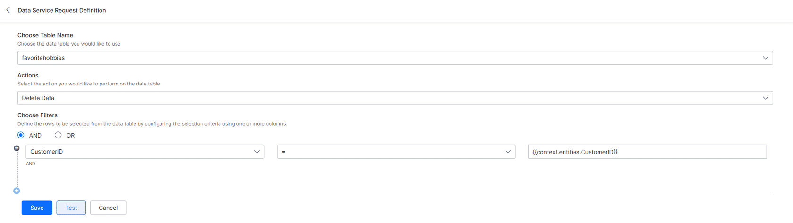

Data TablesandTableViews

> **About** **thiscourse**
>
> **Prerequisites**

**ANALYZE** **DEEP** **DIVE**

> **Introduction** **to** **Data** **Tables**
>
> **Quick** **Review:** **Common** **FunctionsUsed**
>
> **Define** **a** **Data** **Table**
>
> **Collect** **andAddUserData**
>
> **Perform** **CRUDOperations**
>
> **Table** **Views**

**TEST** **YOUR** **UNDERSTANDING**

> **Check** **YourUnderstanding**

**CONCLUSION**

> **Summary**

Lesson 1 of 10

**About** **this** **course**

> Kore.ai’s Data offering lets you store customer information by
> defining Data Tables and
>
> Table
> Views, and perform CRUD operations using a Service Node within a
> Dialog Task.
>
> **CourseObjectives**
>
> By the end of this course, you will be able to:
>
> 1 Build a Data Table
>
> 2 Add, update, get or delete data stored in a Data Table using Service
> nodes
>
> 3 Collect data from users using Forms or Entity nodes within a Dialog
> Task
>
> 4 Join tables using Table Views
>
> **Product**
> **Version**
>
> This course is developed for Experience Optimization (XO Platform
> version 10.0.
>
> **Requirementsforcompletingthiscourse:**
>
> Complete the course and pass the end of the course assessment with a
> min **80%** **score**.
>
> Fill out and submit the **Feedback** **Survey** at the end of the
>
> course
>
> Course Duration**:** **1hour**
>
> **CONTINUE**

Lesson 2 of 10

**Prerequisites**

> **BeforeYou** **Begin**
>
> You should have completed the following courses:
>
> 1 Introduction to Service Nodes
>
> 2 Designing Digital Forms
>
> 3 Introduction to Context and Conversations
>
> 4 Context Management across Dialog Tasks
>
> **CONTINUE**

Lesson 3 of 10

**Introduction** **to** **Data** **Tables**

> **What** **isa** **Data** **Table?**
>
> **Data**
> **Tables**allow you to persist custom data and retrieve it whenever
> needed.
>
> Click each card to review the important terms that will help you to
> fully understand the functionality and capabilities of **Data**
> **Tables.**
>
> CRUD

CRUD represents the four basic operations of data storage: create, read,
update and delete

||
||
||
||
||
||
||
||
||

> A Service node is used in a
>
> Service node Dialog Task to perform a 'behind the scenes' action, such
> as
>
> CRUD
> operations.

||
||
||
||
||

> 1 Define a **Data** **Table** from the **Data** **tab** of the **XO**
> **LandingPage**.
>
> 2 Use a **Data** **Table** inside a **DialogTask** to store the data
> collected from **Digital** **Forms** and **Entity** **nodes.**
>
> 3 Manipulate the data using a **Service** **node** within a
> **DialogTask.**
>
> 4 Create a **Table** **View** from a single table or multiple tables
> for viewing the data stored in the **Data** **Tables**.
>
> Ready to learn more about each step?
>
> **CONTINUE** **TO** **LEARN** **MORE**

Lesson 4 of 10

**Quick** **Review:** **Common** **Functions** **Used**

> Listed below are a few concepts used by our platform that you will
> find useful when using our
>
> Data Tables and Table Views. Although memorizing these concepts is not
> necessary to utilize
>
> the data storage and retrieval functionality, you might find it
> helpful to refresh your memory.

||
||
||
||
||
||
||
||
||
||
||
||
||

||
||
||
||
||
||
||

> Next, you will learn how to create your first data table!
>
> **CONTINUE** **TO** **LEARN** **MORE**

Lesson 5 of 10

**Define** **a** **Data** **Table**

> The
> first step in your data management journey is to define a Data Table.
>
>  style="width:6.375in;height:1.33333in" /> style="width:6.375in;height:1.04167in" />**1**
>
> **Fromthe** **XOmainlandingpage,choose** **Data.**
>
> **Youcancreate** **aNewTable** **orclickthe** **triple** **dot**
> **menuand** **choose** **toImport** **aTable** **Definitionfile.**
>
> **Inthisexample,we** **will** **create** **aNewTable.**
>
>  style="width:0.52083in;height:0.52083in" /> style="width:4.4375in;height:3.95833in" /> style="width:0.38667in;height:0.38667in" /> style="width:0.38667in;height:0.38667in" /> style="width:0.38667in;height:0.38667in" />**2**
>
> **Clickoneachicontolearnabout** **the** **DataTable** **fieldsand**
> **scope**
>
> 
>
> 
>
> 
>
> 
>
> 
>
> 
>
> 
>
>  style="width:4.4375in;height:3.95833in" />

**Name**

Enter a **Table** **Name.**

>  style="width:4.4375in;height:3.95833in" />

**Description**

Describe the purpose of the table.

>  style="width:4.4375in;height:3.95833in" /> style="width:0.38667in;height:0.38667in" />

**Add** **Columns**

> **Name** of the column
>
> **Type** of the data that can be stored in this column. It can be:
>
> string;
>
> date; or
>
> number.
>
> **Required** **flag** to mark the column as mandatory.
>
> **Encrypted** **flag** to secure the data in this column.
>
> **Reference** **Column** to create a dependency with a column from
> another table ie to add a foreign key
>
> constraint. This would ensure that the value entered for this column
> exists in the referenced table
>
> column.

**MaxLength** to limit the maximum length for the column values.

**Default** **Values** to be taken in case the value is missing while
adding a row.

>  style="width:4.4375in;height:3.95833in" />

**Indexes**

Defining one or more indexes for your Data Table will improve the
performance during the data search

and retrieval process.

Here are the options:

> **IndexName** for reference;
>
> **Is** **Unique** flag to define if the index is expected to contain
> unique values;
>
> **Column** **&** **Sort** **Order** – List of columns to be included
> in the index; you can select multiple columns
>
> and specify the sort order (ascending or descending) for each of the
> selected columns.

>  style="width:4.4375in;height:3.95833in" /> style="width:0.38667in;height:0.38667in" />

**BotAssignments**

You will select bots from the drop down list and then select the table
permissions for the bot to "Read,

Write or Delete" data from the table .

>  style="width:4.4375in;height:3.95833in" />

**AppAssignments**

You will select Apps from the drop down list and then select the table
permissions for the App to "Read,

Write or Delete" data from the table.

>  style="width:4.4375in;height:3.95833in" /> style="width:0.38667in;height:0.38667in" />

**Process** **Assignments**

You will select Processes from the drop down list and then select the
table permissions for the Process

to "Read, Write or Delete" data from the table.

> Click **Create** when you are done (this action adds a new **Data**
> **Table**). Your table to
>
> added to **Data** **Table** **page.** If needed, you can export the
> table by clicking the three
>
> dot menu and choosing **Export** **Defintion.**

> Watch the video to see an example of a Data Table created for a
> banking bot.

**VideoTranscript** –

Kore.ai makes it convenient for you to capture, store and manipulate
information using Data Tables. The first step in data management is to
make a Data Table and then, I’ll show you how to populate and edit the
data.

Go to the XO Platform landing page and click on **Data**. Then Click
“**New** **Table**”. I’ll call this Banking Account Inquiry since I plan
to use this table to store information about customers who are inquiring
about our checking or savings accounts. I know that I will want to know
a few things: the **person'sname**, an **email** **address**, the
**type** **of** **account** they are inquiring about, if the inquiry is
from a new or existing customer, and if it is from an existing customer,
I will want their **customerID**.

I will create each of those as a column. All of them are **strings**
except for the **customerID**. That can only be a number so I will
define that here. Typically, you will have information that should be
encrypted, but since this is just an example, I’m not going to toggle
that on for any of my columns. Here you can create **a** **dependency**
**with** **a** **column** **from** **anothertable**. In other words,
this would require that the content entered here exists in the specified
location. You can enter a maximum length of the response and you can set
a default value.

Next, you can create an **index** that will allow you to search only
certain columns. This can improve your search efficiency. For example,
I’ll make an index that will only search the **account** **type**.
Later, when I am inquiring about which type of accounts are of most
interest to customers, this index tells the virtual assistant to only
look through the account column instead of wasting time and energy
looking through other irrelevant content.

Here you can give assess to this table to different bots and choose the
permissions each of them have: **Read,** **Write,** **andDelete**. Keep
in mind that only bots with permissions will be allowed to manipulate
data using a Service node within a Dialog Task.

If you plan to connect apps so that external systems can make API calls,
then you can connect them here and set their permissions.

Finally, if you are using Process apps, then you can also assign
permissions here.

Now, click **Create**. Your table has been defined and can now be
populated with data.

> **Some** **wordsare** **reserved** **bythe** **platform** **and**
> **cannot** **be** **used** **as**
>
> **the** **name** **of** **a** **column.**
>
> **Examplesare:**
>
> IDENTIFIED NUMBER
>
> IMMEDIATE OF
>
> IN
>
> INCREMENT
>
> INDEX
>
> INITIAL
>
> INSERT
>
> INTEGER
>
> INTERSECT
>
> INTO
>
> IS
>
> DATE

ONLINE

ON

OFFLINE

OPTION

ON

ORDER

PCTFREE

PRIOR

PRIVILEGES

PUBLIC

> **To**
> **see** **the** **full** **list** **of** **words,** [**<u>visit
> ourdocumentation.</u>**](https://developer.kore.ai/docs/bots/advanced-topics/data-table/)
>
> **ChangeOwnership** **ofa** **Data** **Table**

You can change the ownership of
a **Data** **Table**or **TableView** by clicking on the 3 dot menu

and choosing **ChangeOwner.**

Any **TablesorViews** associated with the one you are sharing will also
be transferred.

Click the GIF to enlarge it.

> **Export** **or** **Import** **a** **JSONDefinition** **File**

Click the three dot menu next to **CreateTable** and choose
**ImportTableDefinition** to import

a JSON Definition file (rather than creating a new table from scratch).

You can also export any of your **Data** **Tables** by clicking the
three dot menu next to the table

and choosing **ExportDefinition**. It will download to your PC.

Click on the GIF to enlarge it.

> Now that you know how to define and add a table, let's learn how to
> perform data manipulation in the XO platform using a Service node.
>
> **CONTINUE** **TO** **LEARN** **MORE**

Lesson 6 of 10

**Collect** **and** **Add** **User** **Data**

> Now
> I will show you how to create a **Digital** **Form** and then use it
> in a **Dialog** **Task** to collect user information, and then we will
> use a **Service** **node** to add the entities to a **Data**
> **Table**.
>
> The process for populating a **Data** **Table** is:
>
> Create a **Digital** **Form** to collect information OR plan to build
> out individual **Entity** **nodes.**
>
> Create a **Dialog** **Task** and connect the **Digital** **Form**
> using a **Digital** **Form** **node.**
>
> Configure a **Service** **node** to add the collected entities to the
> **Data** **Table.**
>
> **Collect** **User** **Data**
>
> You can add Entity nodes or a Digital Form to your Dialog Task to
> collect entities from a
>
> user.

||
||
||
||

||
||
||
||

||
||
||
||

>  style="width:6.33333in;height:3.95833in" />**Add** **Data** **(User**
> **Information)** **to** **a** **Table**
>
> Use a **Service** **node** to add the entities to the **Data**
> **Table.**
>
> 1 Add a **Bot** **Action** **node.**
>
> 2 Then, add a **Service** **node.**
>
> 3 Choose Data Service as the **Service** **Type.**
>
> 4 Choose Table as the **Type.**
>
> 5 Click **Edit** **Request.** style="width:6.375in;height:3.13542in" />
>
> 6 Choose Add Data as the **Action.**
>
> 7 **Assign** **Values** using a Static or Dynamic value from the
> Context object (Data from your **Digital** **Form** **orEntity**
> **nodes).**
>
> Examples are:
>
> {{context.entities.CustomerID
>
> {{context.forms.UserDetails.Email}}
>
> {{context.currentLanguage}}
>
> {{context.session.UserContext.dept}}
>
> 8 Click **Save** when you're done.
>
> Context
> references will result in an error when you click **Test**.
>
> This is normal since the entities will not be filled until run time.
>
> The Default **Bot** **Action** connection can be set to **End** **of**
> **Dialog** or you could add a concluding **Message** **node.**

>  style="width:6.375in;height:3.16667in" />If the **Bot** **Action**is
> yourfinal node,then you will setthe **Default** **connection**to
> **End** **of** **Dialog.**
>
> If you addan additional **Message** **node**,then the **Default**
> **connection**shouldbe the **Message** **node**. In thatcase,the
> **Message** **node** will be the endof the dialog.
>
> Watch
> the below video to learn how you can create a digital form, add it as
> a task, and
>
> then save the entities to a Data table

**VIDEO** **TRANSCRIPT** –

In the previous video, we created a database that will be used to store
the following information: a name, an email address, an account type,
customer type, and customer ID. Now I will show you how to populate your
table using entities and a service node.

You can use a **Digital** **Form** or **individual** **entity** nodes to
collect user information. I will show you both ways. First, I will
create a Digital Form that collects the user's email address, account
type, customer type, and if relevant, the customer ID. Notice that I’ve
used a visibility rule that will only ask for the customer ID IF they
choose Yes, indicating that they are an existing customer. I can test
that it’s working properly. Okay. Now, let’s create a Dialog Task called
Account Inquiry.

I’ll start with a **friendly** **message** **node** that says, I’m happy
to help you learn more about our accounts. Next, I’ll add an entity node
that asks for their name. Normally I would have included

||
||
||

> Now that you know how to populate a Data Table, we will investigate
> how to make other changes to the Table.
>
> **CONTINUE** **TO** **LEARN** **MORE**

Lesson 7 of 10

**Perform** **CRUD** **Operations**

> Users can add, get, update or delete data using a **Service** **node**
> or can perform these operations
>
> externally using custom APIs
>
> **UsingaService** **Node**

Use
a **Servicenode** inside a **BotActionnode** and you'll be able to
perform **Data** **Table**

CRUD operations with ease

All the CRUD operations use similar steps with little variations so
learning this process is easy!

> 1 Create a **DialogTask.**
>
> 2 Add a **Service** **node.**
>
> 3 Choose a **Service** **Type** of Data Service and the **Type** as
> Table.
>
> 4 Click **Define** **Request.** style="width:6.375in;height:2.61458in" />
>
> 5 Choose the **Table** you want to update and then choose your
> **Action**: add, get, update or delete.
>
> You already know how to add data to a Table, so we will focus on
> **get,updateand** **delete** in this section of the course.
>
> **Get** **Data**

**RequestData**

When you choose to **GetData**, you have the option to filter the data
based on a column. You

can also limit the amount of records returned and offset the number of
records to be skipped.

> **The** **response** **can** **be** **referenced** **in** **other**
> **nodes** **using** **this** **syntax:**
>
> **{{context.**
> **\<service_node_name\>.response.body.queryResult\[\<index\>\]**
> **.\<column_name\>}}**
>
> **Here** **isanexample** **response:**

**VIDEO** **TRANSCRIPT** –

In previous videos, we created a Data Table and then used a Dialog Task
to collect **entities** and add them to a**row** **of** **the** **Data**
**Table**. In this example, I have a Data Table called Customer Contact
Info that contains existing **customernames**, **emails**,
**addresses**, and **phone** **numbers** and I’m populating the Table
with a Dialog Task that uses a **Digital** **Form** and a **Service**
**node**. Now I’ll show you how you can pull that information into a bot
message.

Here I have a little Dialog Task that will be used to confirm a person’s
shipping when they are requesting free company brochures. First, the bot
says they would love to send some brochures. Then the bot asks for their
email address, which is the identifier that is used to pull the correct
row of data from my Data Table.

Let me open the **Service** **node** and show you how I’ve set that up.
Notice that my action is **Get** **Data** and my filter is based on the
email column. When the virtual assistant finds a match for the email the
user entered, then they should return the entire row of information.

That row of information will be returned as a **Custom** **Variable**
named after the **Service** **Node**.

In the message node, I have referenced the name and address stored in
the Custom Variable. **Notice** **the** **square** **bracketswith**
**a** **zero** **inside?** The response is sent as an array so this bit
of

notation is required in order to correctly reference the first set of
information contained in the response.

For testing purposes only, I’ve inserted a breakpoint so I have time to
inspect the Custom Variable before it is discarded.

I’ll open **Talk** **to** **Bot**, open the **Debugger**, and click on
**Session** **Context** **andVariables**. In order to invoke this
dialog, I’ll say Confirm shipping. Now I’ll give the **email**
**address** of an imaginary customer that I know is contained in the
database. ginger@gmail.com

You can see that it’s working, but you can also monitor the Custom
Variable to see what is being returned. This can help you troubleshoot
problems. Now that I am confident that everything is working, I’ll
remove the Breakpoint and **Endthe** **Dialog**.

> **Update** **Data**
>
> To modify existing data you can:
>
> **Select** **andAssign** **Values** against each column to be updated.
>
> These values can be static or a reference to a context object.
>
> Choose **Filters** to specify the rows to be updated. You can use
> column names, operators and a field value (could be static or
> dynamic).

>  style="width:6.375in;height:3.09375in" />Service RequestDefinition:
> Update Data
>
> A Sample Response

**VIDEO** **TRANSCRIPT** –

In this example, I have a Data Table named AccountHolderInformation that
contains seven columns of customer information, including their Account
Number. Sometimes, people need to update their phone number, while
keeping all other information the same.

Here is the Dialog Task I will be using to make the update. I have a
greeting and then I collect an account number which will be used to
locate the row of information that I want to update.

Next, the bot asks for the new telephone number.

And finally, I have a Bot Action that contains a Service node that will
make the Update. Lets look at that Request.

I’ve chosen the AccountHolderInformation table. The Action is Update
Data. All the columns I added to the table appear. The fields will
retain the existing values unless I check that I want to update it. In
that case, I need to enter a new value. I’ve referenced the phone number
entity.

Here is where I specify which row should be updated, which will be the
one that contains the account number entity the user gave to me earlier
in the dialog.

In this message, I let the user know the phone number was updated and of
course, here is my Breakpoint so I have time to investigate the Custom
Variable.

I’ll launch Talk to Bot, open the Debug log, open Session Context and
Variables, and invoke this task.

Once I give the new phone number, I can see the Service Request,
UpdateAll, has sent a response that one record was updated.

Now that I know this is working, I can remove the Breakpoint and end the
dialog.

> **Delete** **Data**
>
> To delete rows from the **Data** **Table** you need to choose the
> filter criteria to specify the
>
> rows to be deleted.
>
> You
> shoulddefine which rows will be deleted.
>
> Here
> is a sample response.

**VIDEO** **TRANSCRIPT** –

In this example, I’ll show you how to delete a row in the Data Table.
This Dialog Task is called **Remove** from Mailing List and is used when
customers no longer want to receive weekly emails about our current
promotions.

Let me give you some background information. I have a Data Table called
Weekly Promotions that contains two columns: **Name** **andEmail**. I
use a Dialog Task with entity nodes and a Service node to add users to
the Table, and then, of course, I use the table to send out emails.

Occasionally, a person wants to stop receiving the emails so this Dialog
Task, Promotion Cancellation will remove them from the **Data**
**Table**.

First, the bot greets them and then collects their email. Here is the
**Bot** **Action** with the **Service** **node**. Let’s look at this
request definition. Here I’ve specified to delete the row containing the
email that matches the one given by the user.

> And, of course, I have this Breakpoint for testing purposes. Let’s use
> Talk to Bot, open the **Debugger**, and click on **Session**
> **Context** **andVariables**. I’ll invoke this task by saying
> cancellation and then I’ll use an email that is currently in the
> **Data** **Table**. The response shows me that one record was
> deleted.
>
> Now that I know it’s all working, I can remove the Breakpoint and end
> the dialog.
>
> **UsingAPI's**

APIs can be used to access the data in the data tables and data views
are as follows:

> Data
> Insert API
>
> Data Update API
>
> Data Delete API
>
> Query Data from Table
>
> Query Data from View
>
> **Formore** **detailsreferto** **the** **API** **guide** **-**
> **[<u>documentation</u>](https://developer.kore.ai/docs/bots/api-guide/data-insert-api/#).**
>
> You've learned how to manipulate data in the **Data** **Tables**.
> Next, you will learn about **Table** **Views**.
>
> **CONTINUE** **TO** **LEARN** **MORE**

Lesson 8 of 10

**Table**
**Views**

**XO**
**Platform** **makesiteasytoretrievedata** **from** **severalData**
**TablesintooneTable**

**View.**

> Watch the below video to learn how Table View works.
>
> **VideoTranscript** –
>
> A Table View allows you to join data from one or more tables so you
> can view only the needed data points for your particular query.
>
> Let me show you how this works. Here I have two tables, one called
> Account Totals and one called Bank Visits. I want to create a Table
> View so I can compare an account holders account

value to their most recent in-person transaction. I need to specify the
relationship so the two Data Tables can be properly combined. The
relationship is that the Account ID and the Banking ID should be
matched. Finally, I want to include the account id, account value, date
and type of visit in the Table View.

There are three ways of joining Data Tables: inner, right outer and left
outer. Let’s take a look at how each of these differ. An Inner join will
only return rows that had a match.

You can see that there were three matches.

A right outer will return all matches and the extra rows from the table
on the right.

A left outer will return all matches and the extra rows from the table
on the left.

Now that you understand how to setup a Table View, you’re ready to build
one on the XO platform.

> **To** **createa** **TableView:**
>
>  You will need one or more **Data** **Tables** built and each of
> them needs a related column that acts as an identifier. The identifier
> will be used to collate the data into the proper rows. Examples are an
> ID, a number, a name, a phone number, or an email.
>
>  Go to the **XO** **landingpage**, click **Data** ,and then **New**
> **View.**
>
>  You will name the view, provide a description and give access to
> the appropriate Bots, Apps, and Processes.
>
>  Then choose **Single** or **Multiple** **Tables**. In this example,
> I will be choosing **Multiple** **Tables**.
>
>  style="width:6.375in;height:2.90625in" />In order to collect
> information from two tables, you will need to setup some basic
> parameters and rules.
>
> **Click** **each** **icon** **to** **learn** **more.**
>
>  style="width:4.1875in;height:3.95833in" /> style="width:0.38667in;height:0.38667in" /> style="width:0.38667in;height:0.38667in" /> style="width:0.38667in;height:0.38667in" /> style="width:0.38667in;height:0.38667in" />
>
> 
>
> 
>
> 
>
> 
>
> 
>
>  style="width:4.1875in;height:3.95833in" />

**Choosetwo** **ormoretables.**

Select your join type:

> Inner
>
> Left Outer
>
> Right Outer
>
>  style="width:4.1875in;height:3.95833in" />

**Match** **uptheIdenti er**

You will select the relationship that will define how the table is
sorted.

You can have up to four join rules.

>  style="width:4.1875in;height:3.95833in" /> style="width:0.38667in;height:0.38667in" />

**Selectcolumns** **to** **beincluded**

You need to specifically name each column that will be part of the Table
View.

>  style="width:4.1875in;height:3.95833in" /> style="width:0.38667in;height:0.38667in" />

**FiltertheData**

Although the data will be pulled based on the rules defined above, you
can further limit the results with a

filter.

>  style="width:4.1875in;height:3.95833in" /> style="width:0.38667in;height:0.38667in" />

**Grouptheresults**

You can choose to group the results based on a column of data.

>  style="width:4.1875in;height:3.95833in" />

**Sorttheresults**

You can define how the Table View will be sorted.

||
||
||
||

>  style="width:6.375in;height:2.07292in" />**Let'smakea** **TableView!**

**VideoTranscript** –

Table Views are exactly how they sound. It’s a way to view and perform
queries on specific collections of data that have been pulled from one
or more Data Tables. These Table Views

function just like **Data** **Tables**, which means you can make
**Service** **calls** to them.

From the XO landing page, click **Data**, **Table** **View**, and
**New** **Table**.

I’ll name the **View** and add my bots. You could also add
**appsandprocessapps**.

Let’s start with setting up a Table View from two Data Tables, My weekly
promotions and my **customercontactinfo** Data Tables. I’ll do an inner
join because I only want to see the customer details for customers who
have opted to be emailed the weekly promotions. I’ll choose the Email
address as the identifier.

When specifying columns, your table name and column name must be exact.
I’ll choose to display the **weeklypromotions.Email**,
**customercontactinfo.Name** and customercontactinfo.PhoneNumber. I’m
not going to use any filters, groupings, or sorting.

Once you have setup a **Table** **View**, you can quickly view the
contents by selecting it and choosing Test. More importantly, you can
use a **Service** **Node** to **GET** information from a Table View in
exactly the same way as you would if this was a Data Table.

The difference is that when you’re setting up your **Data** **Service**,
you would choose **View**. When you define your request, you will select
the View and specify which records to pull based

on an identifier. You can also limit and offset the results.

You can then reference the results using the same syntax you use for
referencing the Custom Variables returned from a Data Table query.

> **Hereisa** **sampleresponsefrom** **a** **TableView** **query.**
>
>  style="width:6.375in;height:5.30208in" />**ChangeOwnership** **ofa**
> **TableView**

You can change the ownership of
a **Data** **Table**or **TableView** by clicking on the 3 dot menu

and choosing **ChangeOwner.**

Any **TablesorViews** associated with the one you are sharing will also
be transferred.

Click the GIF to enlarge it.

> **Import** **or** **Export** **a** **Tableview**

Click the three dot menu next to **CreateView** and choose
**ImportView** to import a JSON

Definition file (rather than creating a new view from scratch).

You can also export any of your **TableViews** by clicking the three dot
menu next to the view

and choosing **ExportDefinition**. It will download to your PC.

Click on the GIF to enlarge it.

> Go ahead and check your understanding!
>
> **CONTINUE**

Lesson 9 of 10

**Check** **Your** **Understanding**

In order to get credit, you must pass the knowledge check.

**Total** **numberof** **questions:** 10

**Passingscore:** 80%

**Numberof** **attempts:** unlimited

Good Luck!

**Question**

01/10

Which of the following is the correct navigation to follow in order to
create a new

Data Table?

> From Talk to Bot, say, “New Table”.
>
> Go to the XO Platform landing page and click on Data. “Table Views”.
>
> Go to the XO Platform landing page and click on Data. “New Table”.

Then Click

Then Click

> Add a service node and choose the type of "Table".

**Question**

02/10

When creating a table, which of the following permissions can you assign
to bots,

apps and process apps? Choose all that apply.

> Read - GET data
>
> Write - ADD and UPDATE data
>
> Delete - DELETE data
>
> Create - ADD and UPDATE data

**Question**

03/10

True or False? It is NOT possible to edit a Data Table from an external
application.

> True
>
> False

**Question**

04/10

When making an UPDATE, you must provide a value for every field in the
row.

> True
>
> False

**Question**

05/10

The response from a Data Service node are saved as a
\_\_\_\_\_\_\_\_\_\_\_\_\_\_\_\_\_\_\_\_\_.

> Custom Variable
>
> Entity
>
> Data Table entry
>
> Breakpoint

**Question**

06/10

The following is a sample response from an ADD Data Service node named
SaveInfo.

> Which of the following is the correct syntax for referencing the Age
> of the Account?

**Click** **on** **theimagetoenlargeit.**

> SaveInfo.response.body.queryResult.AgeofAccount
>
> {{context.SaveInfo.response.body\[0\].AgeofAccount}}
>
> {{context.entities.SaveInfo.AgeofAccount}}
>
> {{context.SaveInfo.response.body.AgeofAccount}}

**Question**

07/10

The following is a Data Service definition. Which of the following
correctly describes

the manipulation that will be performed?

**Click** **on** **theimagetoenlargeit.**

> The virtual assistant will delete the entity, 'CustomerID', from the
> 'favoritehobbies' Data Table, leaving other entries 'as-is'.
>
> The virtual assistant will delete all Customer ID's from the
> 'favoritehobbies' Data Table.
>
> The virtual assistant will delete the row in the Data Table,
> 'favoritehobbies', that contains the Customer ID that matches the
> entity value collected in the Dialog Task.

**Question**

08/10

How many rows of information will be returned with an inner join of
these two Data

Tables that is based off matching the Account ID and Banking ID columns?

**Click** **on** **theimagetoenlargeit.**

> 1
>
> 2
>
> 3
>
> 4
>
> 5

**Question**

09/10

How many rows of information will be returned with an right outer join
of these two

Data Tables that is based off matching the Account ID and Banking ID
columns?

**Click** **on** **theimagetoenlargeit.**

> 1
>
> 2
>
> 3
>
> 4
>
> 5

**Question**

10/10

Once you have defined the join rules and parameters, what additional
functions can

be configured when defining a Table View?

> Sorting
>
> Filtering
>
> Grouping
>
> Data Export to apps

Lesson 10 of 10

**Summary**

> **Managing** **Data** **iseasywithKore.ai**
>
> Our relational database system makes it easy to store, edit, retrieve
> and view valuable
>
> information
> about your business and your customers.
>
> **Key** **Takeaways**
>
> Here is what you have learned in this course.
>
> How to build a Data Table
>
> How to add, update, get or delete data stored in a Data Table
>
> using Service and Script nodes
>
> How to collect data from users using Forms or Entity nodes within
>
> a Dialog Task
>
> How to join tables using Table Views
>
> **To**
> **learn** **more,** **please** **referto** **the** **Kore.ai**
> **Academy** **andthe**
>
> **documentation.**
>
> Thanks for completing the course!
